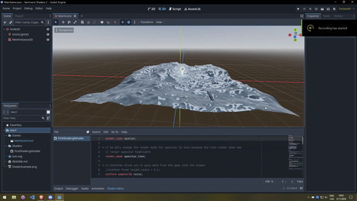

# SeminarioShaders2
Water shader made for Game Devs CSF's second shaders show and tell.

Shader made following this tutorial: https://docs.godotengine.org/en/stable/tutorials/shaders/your_first_shader/your_second_3d_shader.html

## Preview:

